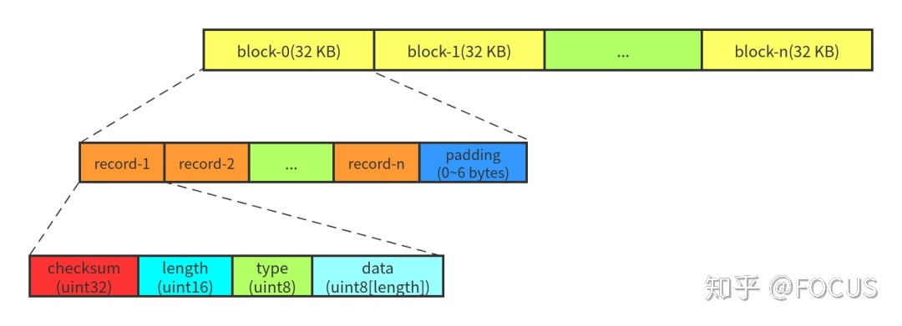
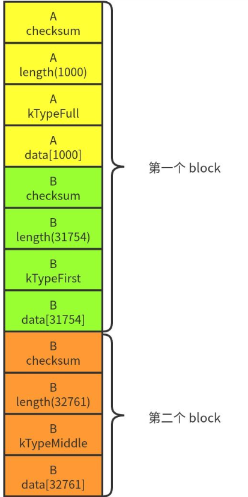
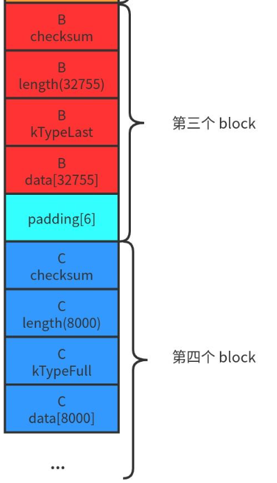

leveldb Log format
==================

Log文件由连续的32Kb大小的Block组成，最后一个可能不足32Kb。[32768Byte]

一个Record的格式如果下：

    block := record* trailer?
    record :=
      checksum: uint32     // crc32c of type and data[] ; little-endian
      length: uint16       // little-endian
      type: uint8          // One of FULL, FIRST, MIDDLE, LAST
      data: uint8[length]

如果一个Block剩余的字节小于7，全部置0，如果刚好7字节，则添加一个数据长度为0的rtecord

当一个大的record被拆分到多个block中时，FIRST表示起始Block，LAST标识终止Block，MIDDLE标识中间Block

    FULL == 1
    FIRST == 2
    MIDDLE == 3
    LAST == 4

例如，如下3个Records

    A: length 1000
    B: length 97270
    C: length 8000

  

----

## Some benefits over the recordio format:

1. 如果局部数据损坏可以很容易跳过该block
2. 很容器将其拆分，用于分布式[map reduce]
3. 对于很大的record，不需要额外的buffering

## Some downsides compared to recordio format:

1. 没有对很小的records进行打包
2. 没有压缩

关于Block大小32Kb的一些延伸，why？

[Use an appropriate page size (ovgu.de)](http://dev.cs.ovgu.de/db/sybase9/help/dbugen9/00000198.htm)